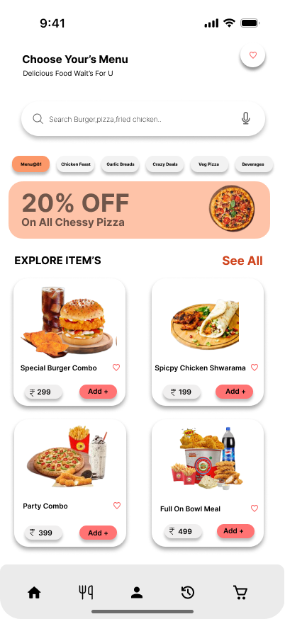

# Burger Order App 🍔

## 📌 Overview
This is a UI/UX design project for a food delivery mobile application designed using Figma. The goal was to create a simple, fast, and user-friendly ordering experience.

## ❗ Problem
Users often face difficulty in quickly browsing menus, placing orders, and tracking deliveries in existing food apps.

## 💡 Solution
Designed a clean and intuitive interface that improves navigation, reduces ordering time, and enhances the overall user experience.

## 🔄 User Flow
User opens app → browses food → selects item → adds to cart → checkout → tracks order

## 🎨 Design Process
- User Research
- Wireframing
- UI Design in Figma
- Prototyping

## ✨ Features
- Easy food browsing
- Clean and modern UI
- Quick checkout process
- Order tracking

## 🛠 Tools Used
- Figma

## 🔗 Figma Design
https://www.figma.com/design/gTTIXaxZnbTK64xYMqKIuu/burger-order-app?node-id=50-145&t=mGR1FvxRy72P2eID-0

